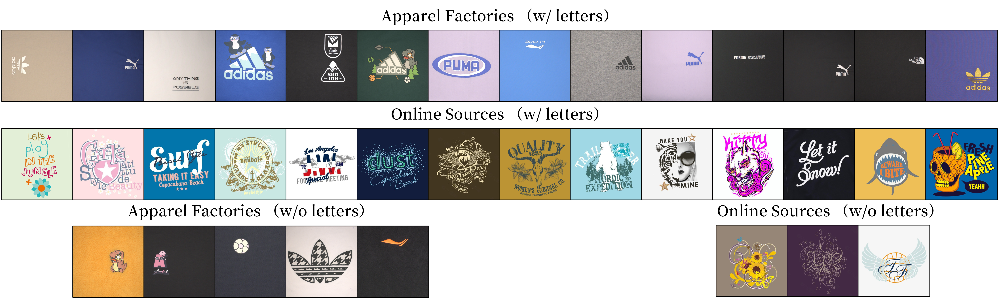
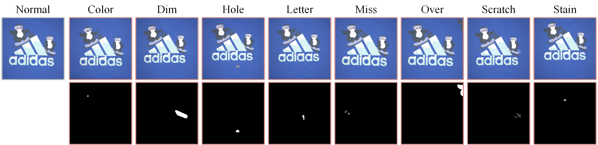

# GPD_dataset

The Garment Printing Defects (GPD) dataset consists of 36 categories of print images, including 1510 images for training and 2531 images for testing. The training set only contains defect-free images, with approximately 40 images per print category, while the test set includes both defective and defect-free images. Among them, 19 categories were collected on-site from apparel factories, while other 17 categories were collected from online sources. The resolution of all images ranges from $600 \times 600$ to $2590 \times 2590$ pixels. We annotated the ground truth at the pixel level with labelme for every defective image.

`printing_dataset.py` is a PyTorch version of a dataset loading script.

